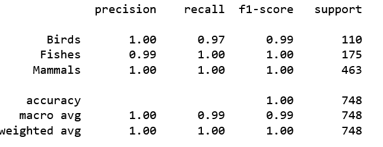
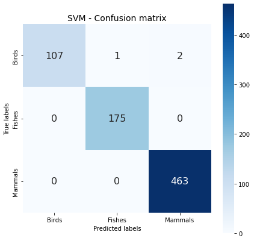
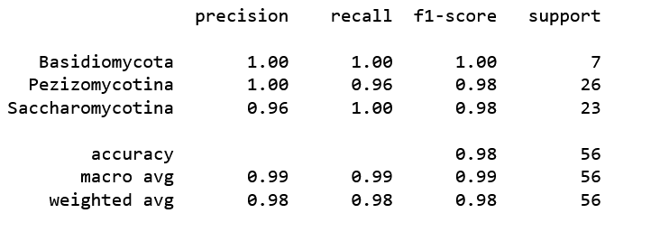

# Machine Learning and Digital Signal Processing for Genome Classification

Project:  Applying Digital Signal Processing: Fourier Transform, and Machine Learning fot genome classification. 

Project based on journal article:   
"ML-DSP: Machine Learning with Digital Signal Processing for ultrafast, accurate, and scalable genome classification at all taxonomic levels."   
Gurjit S. Randhawa*, Kathleen A. Hill* and Lila Kari*, Randhawa et al. BMC Genomics (2019) 20:267 https://doi.org/10.1186/s12864-019-5571-y

*Department of Computer Science, University of Western Ontario, London, ON, Canada

## ML-DSP approach        
        
The authors propose (we quote) <i> a novel combination of supervised Machine Learning with Digital Signal Processing, resulting in ML-DSP: an alignment-free software tool for ultrafast, accurate, and scalable genome classification at all taxonomic levels. They test ML-DSP by classifying 7396 full mitochondrial genomes at various taxonomic levels, from kingdom to genus, with an average classification accuracy of > 97%. </i>   
        
> Their original ML-DSP approach consists of: 
 <i>"The main idea behind ML-DSP is to combine supervised machine learning techniques with digital signal processing, for the purpose of DNA sequence classification. More precisely, for a given set $S={S_1,S_2,…,S_n}$ of n DNA sequences, ML-DSP uses:</i>
        <ul><ul> DNA numerical representations.</ul></ul>
        <ul><ul> Discrete Fourier Transform (DFT) of DNA numerical representations and extraction of spectrum magintudes $M_{i}$ </ul></ul>
        <ul><ul> Pearson Correlation Coefficient (PCC) to compute the distance matrix of all pairwise distances for each pair of magnitude spectra $(M_i,M_j)$, where 1≤i,j≤n  </ul></ul>
        <ul><ul> Supervised Machine Learning classifiers which take the pairwise distance matrix for a set of sequences. </ul></ul>
     
The advantage of their method Our results show that ML-DSP overwhelmingly outperforms the alignment-based software MEGA7 (alignment with MUSCLE or CLUSTALW) in terms of processing time, while having comparable classification accuracies for small datasets and superior accuracies for the large dataset. Compared with the alignment-free software FFP (Feature Frequency Profile), ML-DSP has significantly better classification accuracy, and is overall faster. We also provide preliminary experiments indicating the potential of ML-DSP to be used for other datasets, by classifying 4271 complete dengue virus genomes into subtypes with 100% accuracy, and 4,710 bacterial genomes into phyla with 95.5% accuracy. Lastly, our analysis shows that the “Purine/Pyrimidine”, “Just-A” and “Real” numerical representations of DNA sequences outperform ten other such numerical representations used in the Digital Signal Processing literature for DNA classification purposes.  

 ## Our approach ML-FFT
 
We notice that spectrum phases are left aside in the 
Intuitively, if the magnitude of the spectrum describes the contribution (amplitude, energy if M^2) of various "trains" of signal oscillations, the phase adds an important information about their relative positions. And we should not leave this information aside.  

Birds - Fishes - Mammals
With this dataset, ML-DSP achieves a 100% accuracy !     
We select the first NFFT=256 points of each numerical DNA sequence, compute the FFT spectrum and keep the phase. And without any particular pre-processing we achieve a 98-99% accuracy with Logistic Regression and SVM. After optimising hypermparameters. 
        
For the challenging Fungi dataset, this simple method does not work well, classifcation returns dsipapointing results and we had to develop a DNA sequence alignement method based on cross correlatio acting like a pre-classification filter. The process   but in the end we reached a 94% accuracy. Higher than ML-DSP 
        
** Birds - Fishes - Mammals **
With this dataset, the authors achieve a 100% accuracy !         
We select the first NFFT=256, compute the FFT spectrum, we keep the phase. And without any particular pre-processing we achieve a 98-99% accuracy with Logistic Regression and SVM. After optimising hypermparameters. Like the autorrs, to measure the performance of such a classifier, we use the 10-fold cross-validation technique.      

 | Class   | Genomes     | DNA sequence   |    
| ---     | ---         | ---              |
|         | (count)     |  (min-max length) |
| Birds   |   553       | ML Classification  |
| Fish    | 874         |  ML Classification |
| Mammals | 2313        |                    |        
        
<table border="1" width='750px'>
<tr>
    <td>  
        <figcaption style="text-align:center;color:black;font-size:14px;"> <i>Classification accuracy</i> </figcaption> </td>
    <td>  
        <figcaption style="text-align:center;color:black;font-size:14px;"> <i> Confusion Matrix </i> </figcaption>  </td>

</tr>
<tr style='text-align:center; vertical-align:middle'></tr> 
<table border="1" width='750px'>   
<tr>    
<figcaption style="text-align:center;color:black;font-size:14px;"> <i> Best ML-FFT results with SVM - Linear kernel  </i> </figcaption>
</tr>    
           
        
        
 INSECT DATASET
        
        (2) Class=Fungis. Phylums: Basidiomycota, Pezizomycotina, Saccharomycotina
        
https://github.com/grandhawa/MLDSP/tree/master/DataBase/Fungi

        
| Phylum   | Genomes     |  DNA sequence    |    
| ---     | ---         | ---              |
|         | (count)     |  (min-max length) |
| Basidiomycota   |   30       | ML Classification  |
| Pezizomycotina   | 104       |  ML Classification |
| Saccharomycotina | 90        |  ML Classification |          
        
        
        
        
        
        
  <table border="1" width='750px'>
<tr>
    <td>  
        <figcaption style="text-align:center;color:black;font-size:14px;"> <i>Classification accuracy</i> </figcaption> </td>
    <td>  
        <figcaption style="text-align:center;color:black;font-size:14px;"> <i> Confusion Matrix </i> </figcaption>  </td>

</tr>
<tr style='text-align:center; vertical-align:middle'></tr> 
<table border="1" width='750px'>   
<tr>    
    <figcaption style="text-align:center;color:black;font-size:14px;"> <i> <b>Best ML-FFT+Align</b> results with Logistic regression - solver: newton-cg  </i> </figcaption>
</tr>          
        
        Part I: 
LINK  JUPYTER NOTEBOOK HERE 
        
** Fungi **

Our ML-FFT method is inefficient when classifying Fungis in three (sub)-phylums:  .   
We had to introduce an alignement method for selecting:
         - 3 reference DNA sequence frames 
         - optimal DNA sequence frames (length 256 points) before computiong the FFT.  
At least in a first phase of this project we rely on "soft" alignement for selecting optimal frame, and achieveing a **94%** acuracy with SVM and rbf kernel. After optimizing hyperparameters. Which is better than the best result achived by the authors. The main drawback of our method is a very process of alignement presented in.  
         Part II:   
        part IIb: Alignement technique based on Corss-Correlation. 
LINK  JUPYTER NOTEBOOK HERE
LINK FUNGI JUPYTER NOTEBOOK 
        
 ## Datasets       
        
All datasets are available from Dr. Gurjit S. Randhawa Github following repository:
        
https://github.com/grandhawa/MLDSP/tree/master/DataBase/

Data was extracted from the National Library of Medicine, National Center for Biotechnology Information (NCBI) website. The database can be searched and genome of various live species: plants, fungi... can be downloaded. 

https://www.ncbi.nlm.nih.gov/labs/gquery/all/?term=NC_001224.1

For the alignement process, we imported additional data: Fungi DNA sequences, stored in folder A_Fungi.

 
         
         
         
        
        
        
        
        
        
        
        
        
        
        
        
        
        
        
        
        
        
        
        
        
        
        
        
        
        
        
        
        
        
        
        
        
        
        
        
        
        
        
        
        
        
        
        
        
        
 
        
        
        
       
        
DNA numerical representations.  to obtain a set N={N1,N2,…,Nn} where Ni is a discrete numerical representation of the sequence Si, 1≤i≤n.

Discrete Fourier Transform (DFT) applied to the length-normalized digital signals Ni, to obtain the frequency distribution; the magnitude spectrum Mi of this frequency distribution is then obtained.

Pearson Correlation Coefficient (PCC) to compute the distance matrix of all pairwise distances for each pair of magnitude spectra (Mi,Mj), where 1≤i,j≤n.

Supervised Machine Learning classifiers which take the pairwise distance matrix for a set of sequences, together with their respective taxonomic labels, in a training set, and output the taxonomic classification of a new DNA sequence. To measure the performance of such a classifier, we use the 10-fold cross-validation technique.

Independently, Classical Multidimensional Scaling (MDS) takes the distance matrix as input and returns an (n×q) coordinate matrix, where n is the number of points (each point represents a unique sequence from set S) and q is the number of dimensions. The first three dimensions are used to display a MoDMap, which is the simultaneous visualization of all points in 3D-space. 
      
In the classification process, somes genomes datasets are more challenging than others, particularly the Fungi dataset, in the same phylum, where best accuracy is closer to 90%.   

        
        
$\color{blue}\fcolorbox{red}{white} {Although software tools abound for the comparison, analysis, identification, and classification of genomic sequences, taxonomic classification remains challenging due to the magnitude of the datasets and the
intrinsic problems associated with classification. The need exists for an approach and software tool that addresses the
limitations of existing alignment-based methods, as well as the challenges of recently proposed alignment-free
methods.}$
        
The Abstract is reproduced here in-extenso: 
        
> "Background: Although software tools abound for the comparison, analysis, identification, and classification of
genomic sequences, taxonomic classification remains challenging due to the magnitude of the datasets and the
intrinsic problems associated with classification. The need exists for an approach and software tool that addresses the
limitations of existing alignment-based methods, as well as the challenges of recently proposed alignment-free
methods.
>Results: We propose a novel combination of supervised Machine Learning with Digital Signal Processing, resulting
in ML-DSP: an alignment-free software tool for ultrafast, accurate, and scalable genome classification at all taxonomic
levels. We test ML-DSP by classifying 7396 full mitochondrial genomes at various taxonomic levels, from kingdom to
genus, with an average classification accuracy of > 97%.
A quantitative comparison with state-of-the-art classification software tools is performed, on two small benchmark
datasets and one large 4322 vertebrate mtDNA genomes dataset. Our results show that ML-DSP overwhelmingly
outperforms the alignment-based software MEGA7 (alignment with MUSCLE or CLUSTALW) in terms of processing
time, while having comparable classification accuracies for small datasets and superior accuracies for the large
dataset. Compared with the alignment-free software FFP (Feature Frequency Profile), ML-DSP has significantly better
classification accuracy, and is overall faster.
We also provide preliminary experiments indicating the potential of ML-DSP to be used for other datasets, by
classifying 4271 complete dengue virus genomes into subtypes with 100% accuracy, and 4,710 bacterial genomes
into phyla with 95.5% accuracy.
Lastly, our analysis shows that the “Purine/Pyrimidine”, “Just-A” and “Real” numerical representations of DNA
sequences outperform ten other such numerical representations used in the Digital Signal Processing literature for
DNA classification purposes.
Conclusions: Due to its superior classification accuracy, speed, and scalability to large datasets, ML-DSP is highly
relevant in the classification of newly discovered organisms, in distinguishing genomic signatures and identifying their
mechanistic determinants, and in evaluating genome integrity."   
 
Keywords: Taxonomic classification, Whole genome analysis, Genomic signature, Alignment-free sequence analysis,
Machine learning, Numerical representation of DNA sequences, Digital signal processing, Discrete Fourier transform.  
*Correspondence: grandha8@uwo.ca
1Department of Computer Science, University of Western Ontario, London,
ON, Canada
Full list of author information is available at the end of the article

#### <ul> **DATASET**   </ul> 
        

        
   <ul> $\textcolor{#246EAA}{\textsf{We performed computational experiments on several}}$ $\textcolor{#246EAA}{\textsf{different subsets of this dataset.}}$ $\textcolor{#246EAA}{\textsf{The bacteria dataset comprises all 4710 complete}}$ $\textcolor{#246EAA}{\textsf{bacterial genomes with lengths between 20,000 bp and 500,000 bp}}$  
           
           
           
           , available in the aforementioned NCBI database on the same date.}}$ $\textcolor{#246EAA}{\textsf{Linear regression for predicting home price based on.}}$ $\textcolor{#246EAA}{\textsf{Linear regression for predicting home price based on.}}$ </ul>
        
        
        
        
        
        
        
        
$\textcolor{#246EAA}{\textsf{All datasets in this paper can be found at https://github.com/grandhawa/MLDSP in the “DataBase” directory.}}$
$\textcolor{#246EAA}{\textsf{The mitochondrial dataset comprises all of the 7396 complete reference mtDNA sequences available in the NCBI Reference Sequence Database RefSeq on June 17, 2017.}}$  
                $\textcolor{#246EAA}{\textsf{We performed computational experiments on several different subsets of this dataset. The bacteria dataset comprises all 4710 complete bacterial genomes with lengths between 20,000 bp and 500,000 bp, available in the aforementioned NCBI database on the same date.}}$ 
                $\textcolor{#246EAA}{\textsf{The dengue virus dataset contained all 4721 dengue virus genomes available in the NCBI database on August 10,2017. Note that any letters “N” in these DNA sequences were deleted.}}$

For the performance comparison between ML-DSP and other alignment-free and alignment-based methods we also used the benchmark datasets of 38 influenza virus sequences, and 41 mammalian complete mtDNA sequences from [47].

Datasets are availble on Dr. Gurjit S. Randhawa Github following repositories:

https://github.com/grandhawa/MLDSP/tree/master/DataBase/Birds-Fish-Mammals

https://github.com/grandhawa/MLDSP/tree/master/DataBase/Fungi

Data was extracted from

National Library of Medicine, National Center for Biotechnology Information (NCBI) website. The database can be searched and genome of various live species, plants, fungi.

https://www.ncbi.nlm.nih.gov/labs/gquery/all/?term=NC_001224.1

And DNA sequence dataset from NCIB stored

In Part I we test the application of supervides classifiscation algorithms with FFT of DNA sequences of Birds, Fishes, Mammals. We will see that classic algorithms are able to

In part II, we will attempt to classify of FUngi in 3 categories. With a dataset with few samples: 30 and

Full list of author information is available at the end of the article

        
Dataset used in this study are from NCIB and they are available in the following Gurjit S. Randhawa GitHub repositories: 
        
We will test our approach with 2 datasets:   
        
        (1) Birds-Fish-Mammals: 
 
| Class   | Genomes     | DNA sequence   |    
| ---     | ---         | ---              |
|         | (count)     |  (min-max length) |
| Birds   |   553       | ML Classification  |
| Fish    | 874         |  ML Classification |
| Mammals | 2313        |
 \color{blue}{Although software tools abound for the comparison, analysis, identification, and classification of genomic sequences, taxonomic classification remains challenging due to the magnitude of the datasets and the intrinsic problems associated with classification. The need exists for an approach and software tool that addresses the limitations of existing alignment-based methods, as well as the challenges of recently proposed alignment-free
    methods.} 
|  
        
        
        
        
        
| Class   | Genomes     |  
DNA sequence
 |    
| ---     | ---         | ---              |
|         | (count)     |  (min-max length) |
| Birds   |   553       | ML Classification  |
| Fish    | 874         |  ML Classification |
| Mammals | 2313        |Although software tools abound for the comparison, analysis, identification, and classification of genomic sequences, taxonomic classification remains challenging due to the magnitude of the datasets and the intrinsic problems associated with classification. The need exists for an approach and software tool that addresses the limitations of existing alignment-based methods, as well as the challenges of recently proposed alignment-free
methods. |  
        
        
        

$\color{blue}{The mitochondrial dataset comprises all of the}$

$\color{blue}\fcolorbox{red}{white}{Although software tools abound for the comparison, analysis,}$      
        
        
<dd>        
$\color{blue}\fcolorbox{red}{white}{Although software tools abound for the comparison, analysis, identification, and classification of genomic sequences, taxonomic classification remains challenging due}$
</dd>
        
$\color{blue}\fcolorbox{red}{white}{to the magnitude of the datasets   and the intrinsic problems associated with classification.}$ $\color{blue}\fcolorbox{red}{white}{The need exists for an approach and software tool that addresses the   limitations of existing}$
$\color{blue}\fcolorbox{red}{white}{alignment-based methods, as well as the challenges of recently proposed alignment-free}$ 
        
        
        
        
https://github.com/grandhawa/MLDSP/tree/master/DataBase/Birds-Fish-Mammals
        
        (2) Class=Fungis. Phylums: Basidiomycota, Pezizomycotina, Saccharomycotina
        
https://github.com/grandhawa/MLDSP/tree/master/DataBase/Fungi

        
| Phylum   | Genomes     |  DNA sequence    |    
| ---     | ---         | ---              |
|         | (count)     |  (min-max length) |
| Basidiomycota   |   30       | ML Classification  |
| Pezizomycotina   | 104       |  ML Classification |
| Saccharomycotina | 90        |  ML Classification |   

        
**AUTHOR'S METHODOLOGY**
        

     
$$\textcolor{#2596be}{\text{The main idea behind ML-DSP is to combine supervised machine learning techniques with digital signal processing, for the purpose of DNA sequence classification. More precisely, for a given set S={S1,S2,…,Sn} of n DNA sequences, ML-DSP uses}}$$

        
        
        

 $\textcolor{#2596be}{\text{The main idea behind ML-DSP is to combine supervised machine learning techniques with digital signal processing, for the purpose of DNA sequence classification. More precisely, for a given set S={S1,S2,…,Sn} of n DNA sequences, ML-DSP uses}}$ 

        
        
DNA numerical representations to obtain a set N={N1,N2,…,Nn} where Ni is a discrete numerical representation of the sequence Si, 1≤i≤n.

Discrete Fourier Transform (DFT) applied to the length-normalized digital signals Ni, to obtain the frequency distribution; the magnitude spectrum Mi of this frequency distribution is then obtained.

Pearson Correlation Coefficient (PCC) to compute the distance matrix of all pairwise distances for each pair of magnitude spectra (Mi,Mj), where 1≤i,j≤n.

Supervised Machine Learning classifiers which take the pairwise distance matrix for a set of sequences, together with their respective taxonomic labels, in a training set, and output the taxonomic classification of a new DNA sequence. To measure the performance of such a classifier, we use the 10-fold cross-validation technique.

Independently, Classical Multidimensional Scaling (MDS) takes the distance matrix as input and returns an (n×q) coordinate matrix, where n is the number of points (each point represents a unique sequence from set S) and q is the number of dimensions. The first three dimensions are used to display a MoDMap, which is the simultaneous visualization of all points in 3D-space. 

        
**OUR METHODOLOGY**

        
Birds - Fishes - Mammals
In this dataset, the authors achieve a 100% accuracy !         
We select the first NFFT=256, compute the FFT spectrum, we keep the phase. And without any particular pre-processing we achieve a 98-99% accuracy with Logistic Regression and SVM. After optimising hypermparameters.       
        
The method is inefficient when classifying fungis in three phylums:  . Unfortunately we had to introduce an alignement method for selecting optimal frames (lenght 256 points) before computiong the FFT.  At least in a first phase of this project we rely on "soft" alignement for selecting optimal frame, and achieveing a **94%** acuracy with SVM and rbf kernel. After optimizing hyperparameters. Which is better than the best result achived by the authors. The main drawback of our method is a very process of alignement presented in.  
        
