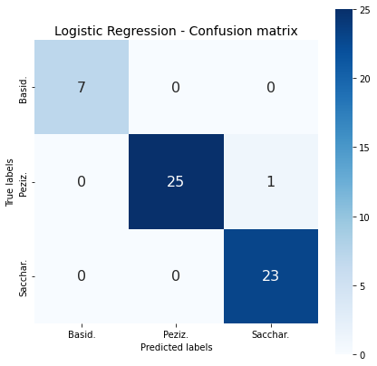

# Machine Learning and Digital Signal Processing for Genome Classification

Project:  Applying Digital Signal Processing: FFT, Spectograms, Wavelets and Machine Learning/Deep Learning to genome classification. 

In this project we develop effective methods for classifying genomes (DNA sequences) based on Digital Signal Processing, Machine Learning, Deep Learning. This is on-going research and results will be published on a regular basis.  
As a starting point we analyzed the following paper:
 
 
 <i><b> "ML-DSP: Machine Learning with Digital Signal Processing for ultrafast, accurate, and scalable genome classification at all taxonomic levels" </b></i> by Gurjit S. Randhawa , Kathleen A. Hill and Lila Kari. https://doi.org/10.1186/s12864-019-5571-y
  
*Department of Computer Science, University of Western Ontario, London, ON, Canada*   
 
Their DNA sequence classification method: ML-DSP is very effective and matches or outperforms the acuuracy of best existing methods with DNA sequence alignment.   They collected a large number of DNA sequences, and built many datasets for validation purposes: Vertebrates, Fungi, Insects...  They thourughly report many classification results. That we will use as reference for our research.  
 
Our objective is to develop methods that outperform the accuracy of ML-DSP with the most challenging datasets: Fungi, Protists, Insects. </ul></ul>

## Datasets       
        
All datasets are available from Dr. Gurjit S. Randhawa Github repository: 
        
https://github.com/grandhawa/MLDSP/tree/master/DataBase/

Data was extracted from the National Library of Medicine, National Center for Biotechnology Information (NCBI) website. The database can be searched and mitochondrial genome of various live species: plants, fungi... can be downloaded.   
Illustration with : https://www.ncbi.nlm.nih.gov/labs/gquery/all/?term=NC_001224.1

          
## ML-DSP approach        
        
The authors propose (<b><i>we cite</i></b>) <i> a novel combination of supervised Machine Learning with Digital Signal Processing, resulting in ML-DSP: an alignment-free software tool for ultrafast, accurate, and scalable genome classification at all taxonomic levels. They test ML-DSP by classifying 7396 full mitochondrial genomes at various taxonomic levels, from kingdom to genus, with an average classification accuracy of > 97%. </i>   
        
> Their original ML-DSP approach consists of: 
 <i>"The main idea behind ML-DSP is to combine supervised machine learning techniques with digital signal processing, for the purpose of DNA sequence classification. More precisely, for a given set $S={S_1,S_2,…,S_n}$ of n DNA sequences, ML-DSP uses:</i>
        <ul><ul> DNA numerical representations.</ul></ul>
        <ul><ul> Discrete Fourier Transform (DFT) of DNA numerical representations and extraction of spectrum magintudes $M_{i}$ </ul></ul>
        <ul><ul> Pearson Correlation Coefficient (PCC) to compute the distance matrix of all pairwise distances for each pair of magnitude spectra $(M_i,M_j)$, where 1≤i,j≤n  </ul></ul>
        <ul><ul> Supervised Machine Learning classifiers which take the pairwise distance matrix for a set of sequences. </ul></ul>
     
Their results show that ML-DSP overwhelmingly outperforms the alignment-based software MEGA7 (alignment with MUSCLE or CLUSTALW) in terms of processing time, while having comparable classification accuracies for small datasets and superior accuracies for the large dataset. Compared with the alignment-free software FFP (Feature Frequency Profile), ML-DSP has significantly better classification accuracy than method and is overall faster. 

## Our initial approach: ML-FFT
 
In the initial ML-FFT  implementation we achieved 100% accuracy with the vertebrate dataset "birds-fish-mammals" by:
- selecting the first NFFT=1024 points of each DNA sequence, 
- applying window and a very low frequency high-pass filter 
- feeding one-sided spectrum (frequency response) to Machine Learning classification algorithms: Logistic Regression, SVM.  
 
This simple method did not work with more challenging datasets like the Fungi dataset.  
 
The Birds - Fishes - Mammals DNA sequences dataset is available here:         
 
https://github.com/grandhawa/MLDSP/tree/master/DataBase/Birds-Fish-Mammals

Dataset:
| Class   | Genomes    (count)   |  
| ---     | ---         | 
| Birds   |   553       | 
| Fish    | 874         | 
| Mammals | 2313        |       
      
        
With this dataset, the authors achieve <b> 100% accuracy </b> with the ML-DSP method ! Results with our classification method are presented below. 
 
We selected the first NFFT=256, 512, 1024, 2048 in each DNA sequence and then computed the FFT spectrum.    We tested the ML-FFT approach with and without the spectrum phase.  Some results are reported in the table below.  It looks like the phase add some value with very short sequences NFFT=256, 512.   Optimal results were achieved with NFFT=1024 and 2048. The phase was not instrumental.    Without any particular pre-processing we achieve an accuracy close to 100% with Logistic Regression and SVM.   Like the authors, to measure the performance of such a classifier, we optimized hyperparameters and used the 10-fold cross-validation technique.      
        
| Approach                                 | Accuracy |      ML Technique         |
| ---                                      | ---      |   ---                     |
|First NFFT=  512 points                   |  97-98%  |       SVM  rbf kernel     | 
|First NFFT= 1024 Magnitude+Phase (1024 features) | <b> ~100% </b> |  SVM linear kernel     |
|First NFFT= 1024 Magnitude only (512 features) | <b> ~100% </b>   |    SVM  rbf kernel     |  

        
We display the best result below.  
        
| Classification report   | Confusion Matrix   |  
| ---     | ---         | 
|          |      |       

The DNA sequence classification of vertebrates, from three different classes is not really a challenge Mammalia is a class of animal within the phylum Chordata      . Classification with other data sets like: Fungi, Insects, Protists is more challenging.   
              
        
##  ML-FFT + "Soft Align"  -  Fungi DNA sequences classification        
    
The small Fungi dataset is available here: 
        
https://github.com/grandhawa/MLDSP/tree/master/DataBase/Fungi

| Phylum   | Genomes    (count)    |  DNA sequence    (min-max length) |    
| ---      |              ---         |                     ---              |
| Basidiomycota   |   30       | 9745 / 235849 |
| Pezizomycotina   | 104       | 1364 / 203051 |
| Saccharomycotina | 90        |18844 / 107123 | 
  
For the challenging Fungi dataset, the simple ML-FFT method does not work. We introduce a soft alignment method ("Soft Align") where:
- all frames length NFFT= 1024 points
- we select a NFFT reference frame in each Fungi phylum (sub-phylum). Three reference frames are indetified. 
- we select an optimal NFFT frame for each DNA sequence in each Fungi phylum. By comparison (cross-correlation) with the three reference frames. 
- then we applied the simple ML-FFT method on optimal NFFT frames. 

<b> ML-FFT + Soft Align outperforms ML-DSP with accuracy between 96 to 98% in a reasonable time.</b>  
 
| ML-FFT + Soft Align Approach  | Accuracy  |      ML Technique   |
| ---      | ---         |   ---      |
|NFFT= 1024 points Magnitude only (512 features)  | <b> 96% </b>    |  Logistic Regression newton-cg solver   SVM "rbf" solver  |
|NFFT= 1024 points Magnitude + Phase (1024 features) | <b> 98% </b>    |  Logistic Regression newton-cg solver         |

        
| Classification report   | Confusion Matrix   |  
| ---     | ---         | 
|          |      |           

##  Protists DNA sequences classification 

ML-FFT + Soft Alignement applied to small protists dataset. 

##  Insects DNA sequences classification 

ML-FFT + Soft Alignement applied to large insect dataset. 

